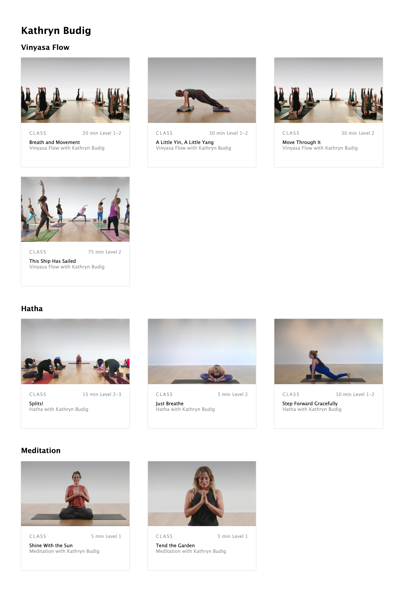

# Glo Take-home

## Problem
We need to return, fetch and manipulate some Glo data in our Node/Express app to display back to users on our site.

#### Please read this entire README before you start!

## Setup

1. Install dependencies

```
$ npm install
```

2. Run the app:
```
$ DEBUG=* npm start
```

## Instructions

There are two parts to this take-home: 1) a back end (API) endpoint, and 2) a front end component.

1. Flesh out the [`GET /api/classes`](http://localhost:3000/api/classes) RESTful endpoint controller in `/routes/classes.js` to return classes. 

	a) It should be possible to filter this end point by teacher IDs.
	
	b) There are three models available to you: `Classes`, `Teachers` and `Styles`. You will likely find cobbling together data from at least 2/3 of these models helpful to arriving at your final payload.

2. The [index page](http://localhost:3000) lists available teachers, which link to their individual pages. Using the endpoint you created in step 1, flesh out these pages (ex. [http://localhost:3000/3](http://localhost:3000/3)) to return the appropriate teacher's classes, grouped by their yoga style. The class card template [`/views/partials/card.hbs`](./views/partials/card.hbs) is styled and ready for you to use for this purpose. As an example, the resulting page layout for [Kathryn Budig's classes](http://localhost:3000/1) should be identical to the following screenshot:




## General tips
- We've marked all the files that require coding, they can be found by performing a directory search for the `TODO` string. (This doesn't mean that files without a `TODO` can't be edited, but it isn't required.)
- Although not necessary to complete the task, feel free to install any external/`npm` modules you find helpful.
